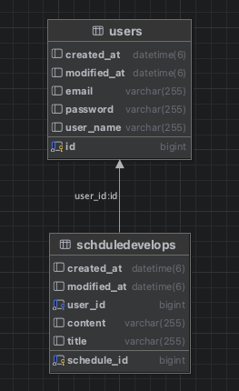

# Schedule Project

## 📖 목차
1. [프로젝트 소개](#프로젝트-소개)
2. [프로젝트 계기](#프로젝트-계기)
3. [주요기능](#주요기능)
4. [개발기간](#개발기간)
5. [기술스택](#기술스택)
6. [Trouble Shooting](#trouble-shooting)
7. [ERD](#ERD)
8. [API 명세](#API명세)

## 👨‍🏫 프로젝트 소개
일정 관리 앱 심화 프로젝트

## 소개
개인 프로젝트 / 내일배움캠프 과제

## 💜 주요기능
1. 일정 생성
2. 일정 조회
3. 일정 수정
4. 일정 삭제
5. 유저 생성
6. 유저 조회
7. 유저 수정
8. 유저 삭제
9. 로그인
10. 댓글 생성
11. 댓글 조회
12. 댓글 수정
13. 댓글 삭제
14. 일정 페이지 조회

## ⏲️ 개발기간
- 2026.04.16(목) ~ 2026.04.23(목)

## 📚️ 기술스택

### ✔️ Language
java Spring

### ✔️ IDE
IntelliJ

## 트러블슈팅
벨로그 참고

## 🗂️ ERD
<details>
<summary>🗂️ <b>ERD 열기</b> </summary>



</details>

## API 명세

<details>
<summary>📌 <b>일정 생성 API</b> </summary>

## 📌 일정 생성 API

- Method: POST  
- URL: `/schedules`

---

- Request Header

| 헤더명        | 값                          | 필수 여부 | 설명                         |
|-------------|-----------------------------|----------|----------------------------|
| Content-Type | application/json            | O        | 요청 데이터 형식              |
| Cookie       | JSESSIONID={세션값}          | O        | 로그인 인증을 위한 세션 쿠키   |

---

- Request Body

```json
{
  "title": "회의",
  "content": "팀 프로젝트 회의"
}
````

---

- Request 필드

| 필드명     | 타입     | 필수 여부 | 설명    |
| ------- | ------ | ----- | ----- |
| title   | String | O     | 일정 제목 |
| content | String | O     | 일정 내용 |

---

- Response

```json
{
  "scheduleId": 1,
  "title": "회의",
  "content": "팀 프로젝트 회의",
  "userId": 1,
  "userName": "홍길동",
  "createdAt": "2026-04-19T15:37:41",
  "modifiedAt": "2026-04-19T15:37:41"
}
```

---

- Response 필드

| 필드명       | 타입            | 설명        |
|-----------| ------------- | --------- |
| scheduleId| Long          | 일정 ID     |
| title     | String        | 일정 제목     |
| content   | String        | 일정 내용     |
| userId    | Long          | 작성자 유저 ID |
| userName  | String        | 작성자 이름    |
| createdAt | LocalDateTime | 생성일       |
| modifiedAt | LocalDateTime | 수정일       |

---

- 상태 코드

| 상태 코드 | 설명                 |
| ----- | ------------------ |
| 201   | 생성 성공              |
| 400   | 잘못된 요청 (필수값 누락 등)  |
| 401   | 인증 실패 (로그인 안 된 상태) |
| 500   | 서버 내부 오류           |

</details>

<details>
<summary>📌 <b>일정 조회 API</b> </summary>

### 전체 일정 조회 API
- Method: GET
- URL: /schedules
- Query Parameter: userName (선택) → 예: /schedules?userName=홍길동
- Request Body: 없음
- Response
```json
{
  "scheduleId": 1,
  "title": "회의",
  "content": "팀 프로젝트 회의",
  "userId": 1,
  "userName": "홍길동",
  "createdAt": "2026-04-10T14:30:00",
  "modifiedAt": "2026-04-10T14:30:00"
}
```
- Response 필드

  | 필드명       | 타입            | 설명     |
  |-----------|---------------|--------|
  | scheduleId | Long          | 일정 ID  |
  | title     | String        | 일정 제목  |
  | content   | String        | 일정 내용  |
  | userId    | Long          | 유저 ID  |
  | userName  | String        | 작성자 이름 |
  | createdAt | LocalDateTime | 생성일    |
  | modifiedAt | LocalDateTime | 수정일    |

- 상태 코드

| 상태 코드 | 설명                |
|-------|-------------------|
| 200   | 성공                |
| 400   | 잘못된 요청 (필수값 누락 등) |
| 500   | 서버 오류             |

### 선택 일정 조회 API
- Method: GET
- URL: /schedules/{scheduleId}
- Request Body: 없음
- Request 필드

- Response
```json
{
  "id": 1,
  "title": "회의",
  "content": "팀 프로젝트 회의",
  "userId": 1,
  "userName": "홍길동",
  "createdAt": "2026-04-10T14:30:00",
  "modifiedAt": "2026-04-10T14:30:00"
}
```
- Response 필드

  | 필드명       | 타입            | 설명     |
  |-----------|---------------|--------|
  | scheduleId    | Long          | 일정 ID  |
  | title     | String        | 일정 제목  |
  | content   | String        | 일정 내용  |
  | userId    | Long          | 유저 ID  |
  | userName  | String        | 작성자 이름 |
  | createdAt | LocalDateTime | 생성일    |
  | modifiedAt | LocalDateTime | 수정일    |


- 상태 코드

| 상태 코드 | 설명                |
|-------|-------------------|
| 200   | 성공                |
| 400   | 잘못된 요청 (필수값 누락 등) |
| 500   | 서버 오류             |
</details>
<details>
<summary>📌 <b>일정 수정 API</b> </summary>

### 일정 수정 API
- Method: PATCH
- URL: /schedules/{scheduleId}

- Request Header

| 헤더명        | 값                          | 필수 여부 | 설명                         |
|-------------|-----------------------------|----------|----------------------------|
| Content-Type | application/json            | O        | 요청 데이터 형식              |
| Cookie       | JSESSIONID={세션값}          | O        | 로그인 인증을 위한 세션 쿠키   |

- Request Body:
```json
{
  "title": "회의",
  "content": "회의 내용"
}
```
- Request 필드

| 필드명     | 타입     | 필수 여부 | 설명        |
|---------| ------ | ----- |-----------|
| title   | String | O     | 수정할 일정 제목 |
| content | String | O     | 수정할 일정 내용 |

- Response
```json
{
  "scheduleId": 1,
  "title": "회의",
  "content": "팀 프로젝트 회의",
  "userId": 1,
  "userName": "홍길동",
  "createdAt": "2026-04-10T14:30:00",
  "modifiedAt": "2026-04-10T14:30:00"
}
```
- Response 필드

  | 필드명       | 타입            | 설명        |
    |-----------|---------------|-----------|
  | scheduleId     | Long          | 일정 ID     |
  | title     | String        | 수정된 일정 제목 |
  | content   | String        | 수정된 일정 내용 |
  | userId    | Long          | 유저 ID     |
  | userName  | String        | 작성자 이름    |
  | createdAt | LocalDateTime | 생성일       |
  | modifiedAt | LocalDateTime | 수정일       |


- 상태 코드

| 상태 코드 | 설명                 |
| ----- | ------------------ |
| 201   | 생성 성공              |
| 400   | 잘못된 요청 (필수값 누락 등)  |
| 401   | 인증 실패 (로그인 안 된 상태) |
| 500   | 서버 내부 오류           |

</details>

<details>
<summary>📌 <b>일정 삭제 API</b> </summary>

### 일정 삭제 API
- Method: DELETE
- URL: /schedules/{scheduleId}
- Request Header

| 헤더명        | 값                          | 필수 여부 | 설명                         |
|-------------|-----------------------------|----------|----------------------------|
| Content-Type | application/json            | O        | 요청 데이터 형식              |
| Cookie       | JSESSIONID={세션값}          | O        | 로그인 인증을 위한 세션 쿠키   |

- Request Body: 없음
- Request 필드 : 없음

- 상태 코드

| 상태 코드 | 설명                 |
| ----- | ------------------ |
| 201   | 생성 성공              |
| 400   | 잘못된 요청 (필수값 누락 등)  |
| 401   | 인증 실패 (로그인 안 된 상태) |
| 500   | 서버 내부 오류           |

</details>

<details>
<summary>📌 <b>유저 생성 API</b> </summary>

### 유저 생성 API
- Method: POST
- URL: /signup
- Request Body:
```json
{
  "userName": "홍길동",
  "email": "hong@example.com",
  "password": "123456789"
}
````

* Request 필드

| 필드명      | 타입     | 필수 여부 | 설명          |
| -------- | ------ | ----- |-------------|
| userName | String | O     | 유저명         |
| password | String | O     | 비밀번호, 8자 이상 |
| email    | String | O     | 이메일         |

* Response

```json
{
  "id": 1,
  "userName": "홍길동",
  "email": "hong@example.com",
  "createdAt": "2026-04-10T14:30:00",
  "modifiedAt": "2026-04-10T14:30:00"
}
```

* Response 필드

| 필드명       | 타입            | 설명    |
| --------- | ------------- | ----- |
| id        | Long          | 유저 ID |
| userName  | String        | 유저명   |
| email     | String        | 이메일   |
| createdAt | LocalDateTime | 작성일   |
| modifiedAt | LocalDateTime | 수정일   |

* 상태 코드

| 상태 코드 | 설명                |
| ----- | ----------------- |
| 201   | 생성 성공             |
| 400   | 잘못된 요청 (필수값 누락 등) |
| 500   | 서버 오류             |

</details>

<details>
<summary>📌 <b>유저 조회 API</b> </summary>

### 전체 유저 조회 API

* Method: GET

* URL: /users

* Request Body: 없음

* Request 필드 : 없음

* Response

```json
{
  "id": 1,
  "userName": "홍길동",
  "email": "hong@example.com",
  "createdAt": "2026-04-10T14:30:00",
  "modifiedAt": "2026-04-10T14:30:00"
}
```

* Response 필드

| 필드명       | 타입            | 설명    |
| --------- | ------------- | ----- |
| id        | Long          | 유저 ID |
| userName  | String        | 유저명   |
| email     | String        | 이메일   |
| createdAt | LocalDateTime | 작성일   |
| modifiedAt | LocalDateTime | 수정일   |

* 상태 코드

| 상태 코드 | 설명                |
| ----- | ----------------- |
| 200   | 성공                |
| 400   | 잘못된 요청 (필수값 누락 등) |
| 500   | 서버 오류             |

### 선택 유저 조회 API

* Method: GET

* URL: /users/{id}

* Request Body: 없음

* Request 필드 : 없음

* Response

```json
{
  "id": 1,
  "userName": "홍길동",
  "email": "hong@example.com",
  "createdAt": "2026-04-10T14:30:00",
  "modifiedAt": "2026-04-10T14:30:00"
}
```

* Response 필드

| 필드명       | 타입            | 설명    |
| --------- | ------------- | ----- |
| id        | Long          | 유저 ID |
| userName  | String        | 유저명   |
| email     | String        | 이메일   |
| createdAt | LocalDateTime | 작성일   |
| modifiedAt | LocalDateTime | 수정일   |

* 상태 코드

| 상태 코드 | 설명                |
| ----- | ----------------- |
| 200   | 성공                |
| 400   | 잘못된 요청 (필수값 누락 등) |
| 500   | 서버 오류             |

</details>

<details>
<summary>📌 <b>유저 수정 API</b> </summary>

### 유저 수정 API

* Method: PATCH
* URL: /users/{id}

- Request Header

| 헤더명        | 값                          | 필수 여부 | 설명                         |
|-------------|-----------------------------|----------|----------------------------|
| Content-Type | application/json            | O        | 요청 데이터 형식              |
| Cookie       | JSESSIONID={세션값}          | O        | 로그인 인증을 위한 세션 쿠키   |

* Request Body:

```json
{
  "userName": "홍길동",
  "email": "hong@example.com"
}
```

* Request 필드

| 필드명      | 타입     | 필수 여부 | 설명      |
| -------- | ------ | ----- | ------- |
| userName | String | O     | 수정할 유저명 |
| email    | String | O     | 수정할 이메일 |

* Response

```json
{
  "id": 1,
  "userName": "홍길동",
  "email": "hong@example.com",
  "createdAt": "2026-04-10T14:30:00",
  "modifiedAt": "2026-04-10T14:30:00"
}
```

* Response 필드

| 필드명       | 타입            | 설명      |
| --------- | ------------- | ------- |
| id        | Long          | 유저 ID   |
| userName  | String        | 수정된 유저명 |
| email     | String        | 수정된 이메일 |
| createdAt | LocalDateTime | 작성일     |
| modifiedAt | LocalDateTime | 수정일     |

* 상태 코드

| 상태 코드 | 설명                |
| ----- | ----------------- |
| 200   | 성공                |
| 400   | 잘못된 요청 (필수값 누락 등) |
| 500   | 서버 오류             |

</details>

<details>
<summary>📌 <b>유저 삭제 API</b> </summary>

### 유저 삭제 API

* Method: DELETE

* URL: /users/{id}

- Request Header

| 헤더명        | 값                          | 필수 여부 | 설명                         |
|-------------|-----------------------------|----------|----------------------------|
| Content-Type | application/json            | O        | 요청 데이터 형식              |
| Cookie       | JSESSIONID={세션값}          | O        | 로그인 인증을 위한 세션 쿠키   |

* Request Body: 없음

* Request 필드 : 없음

* 상태 코드

| 상태 코드 | 설명                |
| ----- | ----------------- |
| 204   | 성공                |
| 400   | 잘못된 요청 (필수값 누락 등) |
| 500   | 서버 오류             |

</details>

<details>
<summary>📌 <b>유저 로그인 API</b> </summary>

### 유저 로그인 API
- Method: POST
- URL: /login
- Request Body:
```json
{
  "email": "hong@example.com",
  "password": "123456789"
}
````

* Request 필드

| 필드명      | 타입     | 필수 여부 | 설명          |
| -------- | ------ | ----- |-------------|
| email    | String | O     | 이메일         |
| password | String | O     | 비밀번호, 8자 이상 |

* Response

```json
{
  "id": 1,
  "userName": "홍길동",
  "email": "hong@example.com"
}
```

* Response 필드

| 필드명       | 타입            | 설명    |
| --------- | ------------- | ----- |
| id        | Long          | 유저 ID |
| userName  | String        | 유저명   |
| email     | String        | 이메일   |

* 상태 코드

| 상태 코드 | 설명                |
|-------| ----------------- |
| 200   | 성공             |
| 400   | 잘못된 요청 (필수값 누락 등) |
| 500   | 서버 오류             |

</details>

<details>
<summary>📌 <b>댓글 생성 API</b> </summary>

## 📌 댓글 생성 API

- Method: POST  
- URL: `/schedules/{scheduleId}/comments`

---

- Request Header

| 헤더명        | 값                          | 필수 여부 | 설명                         |
|-------------|-----------------------------|----------|----------------------------|
| Content-Type | application/json            | O        | 요청 데이터 형식              |
| Cookie       | JSESSIONID={세션값}          | O        | 로그인 인증을 위한 세션 쿠키   |

---

- Request Body

```json
{
  "content": "댓글 내용입니다."
}
````

---

* Request 필드

| 필드명     | 타입     | 필수 여부 | 설명    |
| ------- | ------ | ----- | ----- |
| content | String | O     | 댓글 내용 |

---

* Response

```json
{
  "commentId": 1,
  "content": "댓글 내용입니다.",
  "scheduleId": 1,
  "userId": 1,
  "userName": "홍길동",
  "createdAt": "2026-04-21T14:30:00",
  "modifiedAt": "2026-04-21T14:30:00"
}
```

---

* Response 필드

| 필드명        | 타입            | 설명        |
| ---------- | ------------- | --------- |
| commentId  | Long          | 댓글 ID     |
| content    | String        | 댓글 내용     |
| scheduleId | Long          | 일정 ID     |
| userId     | Long          | 작성자 유저 ID |
| userName   | String        | 작성자 이름    |
| createdAt  | LocalDateTime | 생성일       |
| modifiedAt | LocalDateTime | 수정일       |

---

* 상태 코드

| 상태 코드 | 설명                 |
| ----- | ------------------ |
| 201   | 생성 성공              |
| 400   | 잘못된 요청 (필수값 누락 등)  |
| 401   | 인증 실패 (로그인 안 된 상태) |
| 500   | 서버 내부 오류           |

</details>

<details>
<summary>📌 <b>댓글 조회 API</b> </summary>

### 전체 댓글 조회 API

* Method: GET
* URL: /schedules/{scheduleId}/comments
* Request Body: 없음
* Response

```json
{
  "commentId": 1,
  "content": "댓글 내용입니다.",
  "scheduleId": 1,
  "userId": 1,
  "userName": "홍길동",
  "createdAt": "2026-04-21T14:30:00",
  "modifiedAt": "2026-04-21T14:30:00"
}
```

* Response 필드

| 필드명        | 타입            | 설명     |
| ---------- | ------------- | ------ |
| commentId  | Long          | 댓글 ID  |
| content    | String        | 댓글 내용  |
| scheduleId | Long          | 일정 ID  |
| userId     | Long          | 유저 ID  |
| userName   | String        | 작성자 이름 |
| createdAt  | LocalDateTime | 생성일    |
| modifiedAt | LocalDateTime | 수정일    |

* 상태 코드

| 상태 코드 | 설명                |
| ----- | ----------------- |
| 200   | 성공                |
| 400   | 잘못된 요청 (필수값 누락 등) |
| 500   | 서버 오류             |

</details>

<details>
<summary>📌 <b>일정 페이징 조회 API</b> </summary>

### 일정 페이징 조회 API

* Method: GET
* URL: /schedules
* Query Parameter:
  - page (int, 선택, 기본값: 0)
  - size (int, 선택, 기본값: 10)
* Request Body: 없음
* Response

```json
{
  "content": [
    {
      "scheduleId": 1,
      "title": "회의",
      "content": "팀 프로젝트 회의",
      "commentCount": 2,
      "userName": "홍길동",
      "createdAt": "2026-04-21T19:45:31.491164",
      "modifiedAt": "2026-04-21T19:45:31.491164"
    }
  ],
  "totalElements": 1,
  "totalPages": 1,
  "size": 10,
  "number": 0,
  "first": true,
  "last": true
}
````

* Response 필드

### 📌 content (일정 목록)

| 필드명          | 타입            | 설명     |
| ------------ | ------------- | ------ |
| scheduleId   | Long          | 일정 ID  |
| title        | String        | 일정 제목  |
| content      | String        | 일정 내용  |
| commentCount | Long          | 댓글 개수  |
| userName     | String        | 작성자 이름 |
| createdAt    | LocalDateTime | 생성일    |
| modifiedAt   | LocalDateTime | 수정일    |

### 📌 페이지 정보

| 필드명           | 타입      | 설명           |
| ------------- | ------- | ------------ |
| totalElements | Long    | 전체 데이터 개수    |
| totalPages    | int     | 전체 페이지 수     |
| size          | int     | 페이지 당 데이터 개수 |
| number        | int     | 현재 페이지 번호    |
| first         | boolean | 첫 페이지 여부     |
| last          | boolean | 마지막 페이지 여부   |

* 상태 코드

| 상태 코드 | 설명     |
| ----- | ------ |
| 200   | 성공     |
| 400   | 잘못된 요청 |
| 500   | 서버 오류  |

</details>


